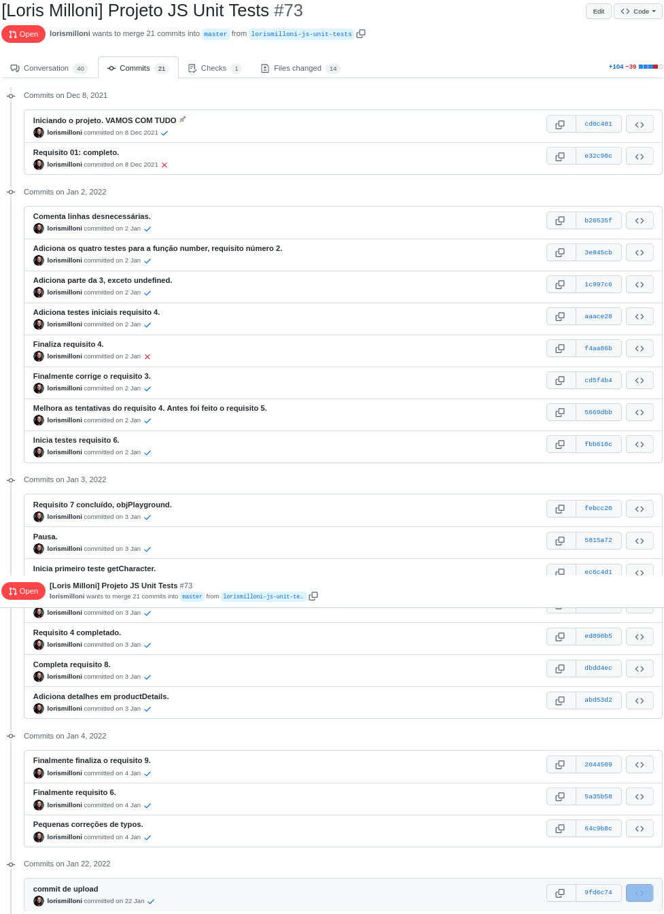
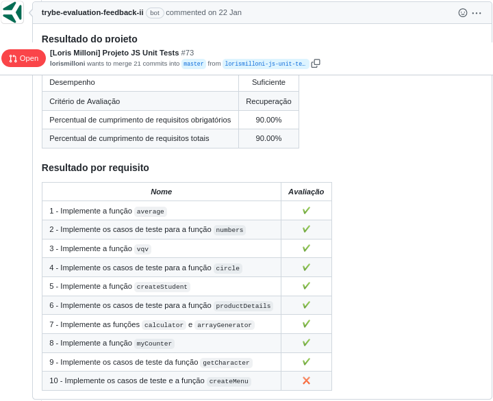

Made in **22/01/2022**.

## In this assignment we learned how to implement tests for functions that was already made and also created functions for tests that were created.
#### Our learning goal was to understand how tests and Test Driven Development works.
 

#### You can see my website in [this link](https://lorismilloni.github.io/study-project-js-unit-tests/).

#### Trybe has a private repository with files that can't be shared. So here is my commit history print:

#### Here is the Trybe Evaluator

